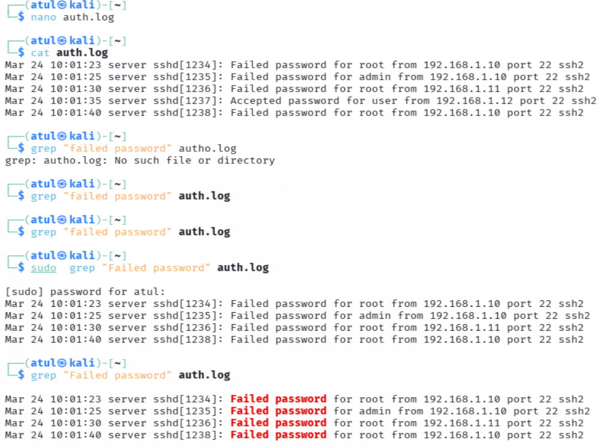
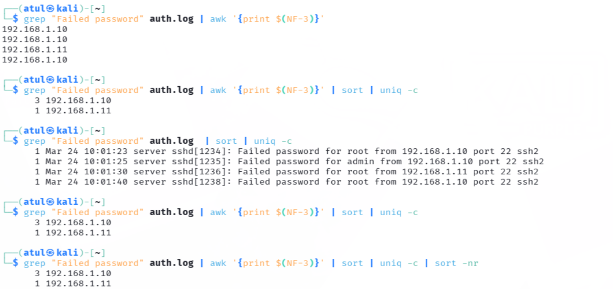
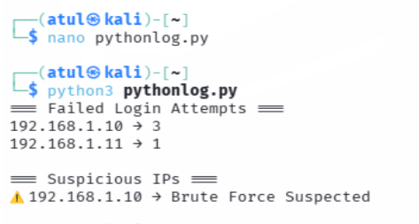

# 🛡️ SOC Day 1 – Linux Log Analysis (Brute Force Detection)

## 📌 Project Overview

This project demonstrates how a Security Operations Center (SOC) Analyst detects brute-force login attempts by analyzing Linux authentication logs. The analysis is performed using both manual investigation techniques and Python-based automation.

---

## 🎯 Objective

* Analyze Linux authentication logs (`auth.log`)
* Detect multiple failed login attempts
* Identify suspicious IP addresses
* Understand brute-force attack patterns

---

## 🧠 Skills Gained

* Log Analysis (Linux Authentication Logs)
* Brute Force Attack Detection
* Command Line Analysis (grep, awk, sort, uniq)
* Python Scripting for Log Parsing
* SOC Investigation & Reporting

---

## 🛠️ Tools & Technologies Used

* **Operating System:** Kali Linux / Ubuntu
* **Languages:** Python
* **Command Line Tools:** grep, awk, sort, uniq
* **Logs:** Linux `/var/log/auth.log`

---

## 📂 Project Structure

```
soc-day1-linux-log-analysis/
│── auth.log
│── log_analyzer.py
│── README.md
│── screenshot.png (optional)
```

---

## 📄 Log Sample

```
Mar 24 10:01:23 server sshd[1234]: Failed password for root from 192.168.1.10 port 22 ssh2
Mar 24 10:01:25 server sshd[1235]: Failed password for admin from 192.168.1.10 port 22 ssh2
Mar 24 10:01:30 server sshd[1236]: Failed password for root from 192.168.1.11 port 22 ssh2
Mar 24 10:01:35 server sshd[1237]: Accepted password for user from 192.168.1.12 port 22 ssh2
Mar 24 10:01:40 server sshd[1238]: Failed password for root from 192.168.1.10 port 22 ssh2
```

---

## 🔍 Manual Analysis

* Filtered failed login attempts
* Observed repeated login failures from same IP
* Identified attacker IP: **192.168.1.10**
* Total attempts: **3**
* Attack type: **Brute Force Attack**

---

## 🛠️ Command Line Analysis

### 🔹 Step 1: Filter Failed Logins

```bash
grep "Failed password" auth.log
```

### 🔹 Step 2: Extract IP Addresses

```bash
grep "Failed password" auth.log | awk '{print $(NF-3)}'
```

### 🔹 Step 3: Count Attempts per IP

```bash
grep "Failed password" auth.log | awk '{print $(NF-3)}' | sort | uniq -c
```

### 🔹 Step 4: Identify Top Attacker

```bash
grep "Failed password" auth.log | awk '{print $(NF-3)}' | sort | uniq -c | sort -nr
```

---

## 🧑‍💻 Python Automation

```python
import re
from collections import defaultdict

log_file = "auth.log"
failed_attempts = defaultdict(int)

with open(log_file, "r") as file:
    for line in file:
        if "Failed password" in line:
            ip_match = re.search(r'from (\d+\.\d+\.\d+\.\d+)', line)
            if ip_match:
                ip = ip_match.group(1)
                failed_attempts[ip] += 1

print("=== Failed Login Attempts ===")

for ip, count in failed_attempts.items():
    print(f"{ip} → {count}")

print("\n=== Suspicious IPs ===")

for ip, count in failed_attempts.items():
    if count >= 3:
        print(f"⚠️ {ip} → Brute Force Suspected")
```

---

## ▶️ How to Run

```bash
python3 log_analyzer.py
```

---

## 📊 Output Example

```
192.168.1.10 → 3
192.168.1.11 → 1

⚠️ 192.168.1.10 → Brute Force Suspected
```

---

## 🚨 Incident Report

| Field           | Details            |
| --------------- | ------------------ |
| Attack Type     | Brute Force Attack |
| Source IP       | 192.168.1.10       |
| Attempts        | 3                  |
| Target Accounts | root, admin        |
| Severity        | Medium             |

---
## 📸 Screenshots

### 🔹 Log Analysis


### 🔹 Command Execution


### 🔹 Final Output



## 🎯 Key Takeaways

* Multiple failed login attempts indicate brute-force attacks
* Log analysis is a core skill for SOC analysts
* Automation helps in faster detection
* Command line tools are essential in real-world SOC environments

---

## 🚀 Future Improvements

* Add time-based attack detection
* Integrate GeoIP lookup for IP tracking
* Send automated alerts (Email/Slack)
* Deploy in SIEM tools like Splunk or Wazuh

---

## 📌 Conclusion

This project simulates a real-world SOC scenario where brute-force attacks are detected using log analysis and automation. It builds a strong foundation for working with SIEM tools and handling security incidents.

---

## 👨‍💻 Author

**Atul Paswan**
Cybersecurity Enthusiast | SOC Analyst Learner

